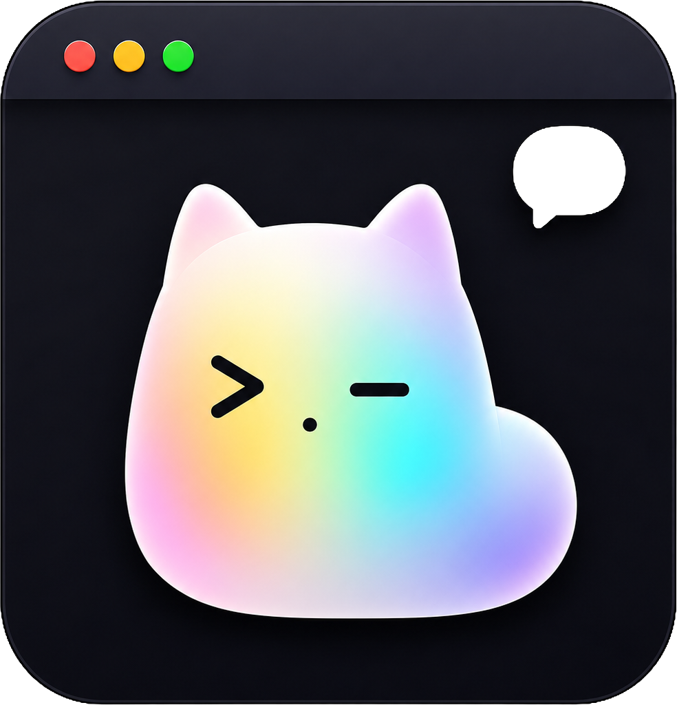
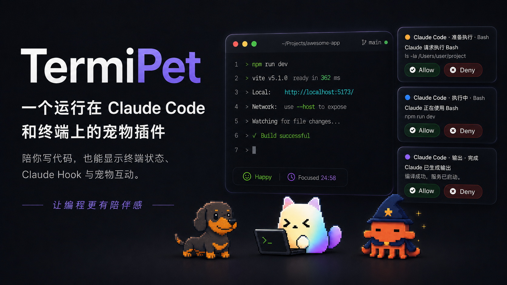
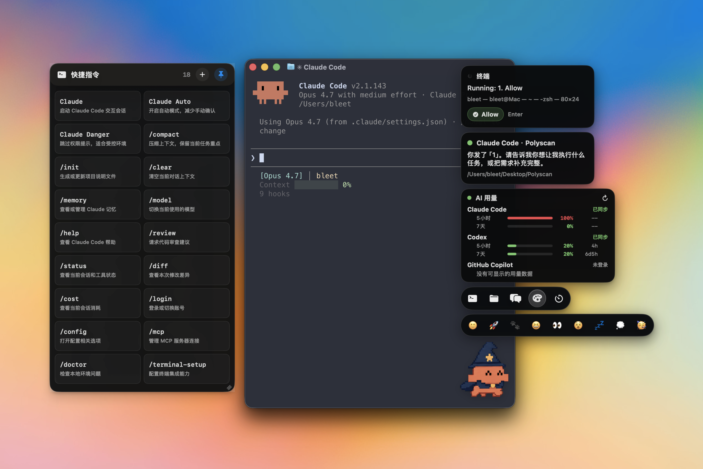
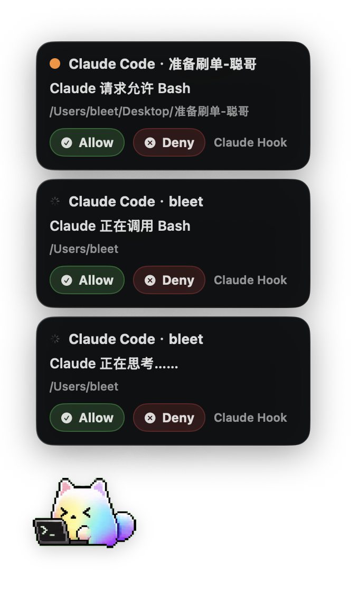
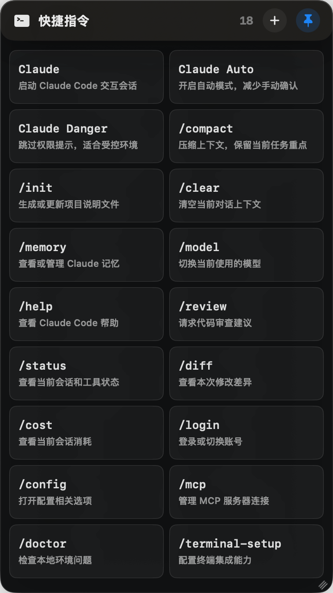
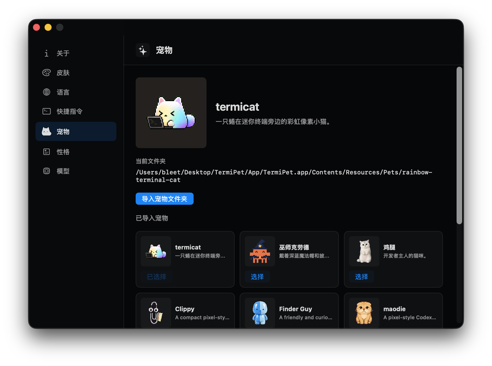
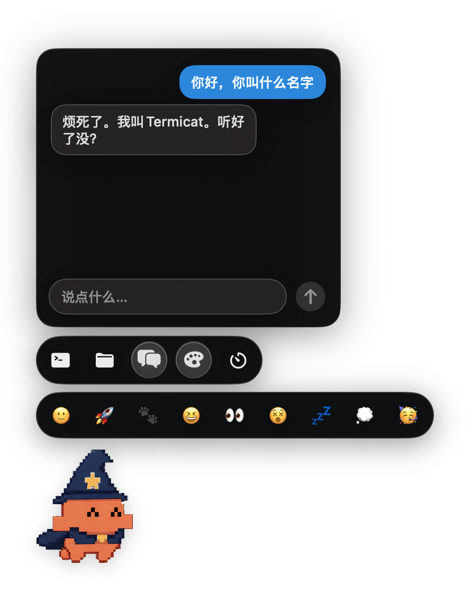
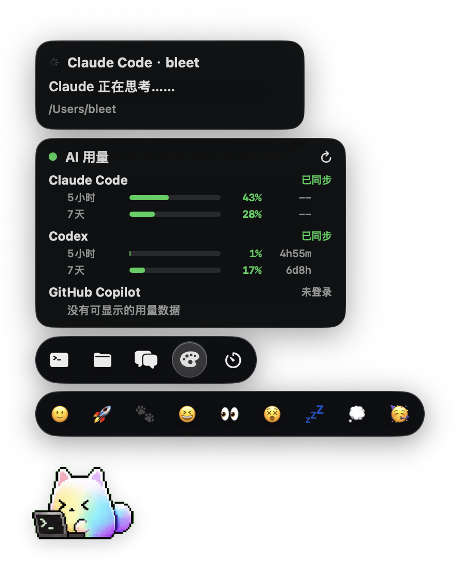

# TermiPet

<p align="center">
  
</p>

<p align="center">
  <b>macOS 터미널과 Claude Code 워크플로를 위한 데스크톱 펫 어시스턴트</b>
</p>

<p align="center">
  <a href="README.md">简体中文</a>
  ·
  <a href="README.zh-TW.md">繁體中文</a>
  ·
  <a href="README.en.md">English</a>
  ·
  <a href="README.ja.md">日本語</a>
  ·
  <a href="README.ko.md">한국어</a>
</p>

<p align="center">
  
  
  
</p>

TermiPet은 macOS 데스크톱 위에 떠 있는 펫 어시스턴트입니다. 터미널 사용자와 AI 코딩 도구 사용자를 위해 **터미널 상태 확인**, **자주 쓰는 명령 입력**, **Claude Code / Codex / GitHub Copilot 사용량 확인**, 그리고 로컬 모델 또는 온라인 API를 통한 **펫 채팅**을 제공합니다.

<p align="center">
  
</p>

TermiPet은 단순한 장식이 아닙니다. 평소에는 화면 가장자리에서 조용히 있다가, 필요할 때 툴바, 상태 카드, 명령 패널, 포모도로, 채팅 창을 열어 주는 가벼운 워크플로 입구입니다.

<p align="center">
  
</p>

## 주요 기능

| 기능 | 설명 |
| --- | --- |
| 플로팅 데스크톱 펫 | 메뉴 막대 앱으로 실행되며 Dock 공간을 차지하지 않고 터미널 근처에 둘 수 있습니다. |
| 터미널 인식 | Terminal, iTerm2, Ghostty, Warp, WezTerm, Alacritty, Kitty 등을 지원합니다. |
| 터미널 미리보기 | 창 제목, 출력 요약, 현재 상태, 알림 정보를 표시합니다. |
| 명령 패널 | Claude Code 자주 쓰는 명령을 내장하고, 사용자 명령 추가, 고정, 정렬을 지원합니다. |
| 폴더 바로가기 | 프로젝트 폴더를 선택하면 해당 `cd` 명령을 대상 터미널에 입력합니다. |
| Claude Code Hook | 생각 중, 도구 호출, 권한 요청, 컨텍스트 압축, 완료 상태를 동기화합니다. |
| 펫 채팅 | 로컬 Ollama, OpenAI, Google Gemini, OpenAI-compatible 커스텀 API를 지원합니다. |
| 성격 설정 | 펫 이름, 사용자 이름, 성격 프리셋, 커스텀 Prompt, 추가 제약을 설정할 수 있습니다. |
| 포모도로 | 25분 집중과 5분 휴식을 지원하며 완료 시 펫 애니메이션이 재생됩니다. |
| AI 사용량 카드 | Claude Code, Codex, GitHub Copilot의 간단한 사용량 정보를 읽어 옵니다. |
| 내장 및 커스텀 펫 | Terminal Cat은 TermiPet의 마스코트이며, 직접 만든 펫 패키지도 가져올 수 있습니다. |
| 다국어와 스킨 | 중국어 간체, 중국어 번체, 영어, 일본어, 한국어와 여러 스킨을 지원합니다. |

## 인터페이스 미리보기

### 상태 카드와 권한 요청

TermiPet은 Claude Code 같은 AI 코딩 도구의 상태를 플로팅 카드로 정리합니다. 프로젝트, 실행 동작, 작업 디렉터리, Hook 출처, Allow / Deny 권한 요청을 한눈에 볼 수 있습니다.

<p align="center">
  
</p>

### 명령 패널

명령 패널은 `/compact`, `/review`, `/status`, `/diff` 같은 Claude Code 명령을 가까이에 둡니다. 현재 터미널에 바로 입력하거나, 사용자 명령을 추가하고 순서를 바꾸거나 고정할 수 있습니다.

<p align="center">
  
</p>

### 펫 전환

TermiPet에는 여러 펫이 내장되어 있습니다. 기본 주인공은 `Terminal Cat`이며, 대기, 생각, 실행, 알림, 오류, 수면, 축하 같은 상태에 맞춰 움직입니다.

<p align="center">
  
</p>

### 펫 대화

플로팅 툴바의 채팅 버튼을 누르면 현재 펫과 바로 대화할 수 있습니다. 채팅 모델은 로컬 Ollama, OpenAI, Google Gemini 또는 OpenAI API 호환 서비스를 사용할 수 있습니다.

<p align="center">
  
</p>

### 플로팅 툴바와 사용량 카드

펫 근처로 마우스를 옮기면 명령, 폴더, 채팅, 스킨, 포모도로 입구가 열립니다. AI 사용량 카드는 Claude Code, Codex, GitHub Copilot의 가벼운 사용량 상태를 보여 줍니다.

<p align="center">
  
</p>

## 개인정보와 데이터

TermiPet은 Mac에서 로컬로 실행되며 **자체 클라우드 중계 서버를 제공하지 않습니다**. 설정, 키, 상태 정보는 가능한 한 로컬에 보관되며, 사용자가 외부 모델 또는 공식 서비스 엔드포인트를 설정한 경우에만 해당 주소로 요청합니다.

| 데이터 | 저장 또는 사용 방식 |
| --- | --- |
| 온라인 모델 API Key | **macOS Keychain에 저장**되며 TermiPet 서버로 업로드되지 않습니다. |
| 모델 Base URL과 모델명 | Application Support 디렉터리에 로컬 저장됩니다. |
| 로컬 Ollama 채팅 | Mac의 로컬 Ollama 서비스로 전송됩니다. |
| OpenAI / Gemini / 커스텀 API 채팅 | 사용자가 설정한 제공자 엔드포인트로 직접 전송됩니다. |
| Claude Code / Codex 사용량 읽기 | 로컬 인증 정보 또는 설정을 사용해 Mac에서 공식 API로 직접 요청합니다. |
| Claude Code Hook 상태 | `127.0.0.1`의 TermiPet 로컬 서비스로만 전송됩니다. |

## 요구 사항

| 항목 | 요구 사항 |
| --- | --- |
| OS | macOS 14.0 이상 |
| 빌드 도구 | Swift 6 |
| 로컬 채팅 | 선택 사항, [Ollama](https://ollama.com) 필요 |
| 온라인 모델 | 선택 사항, OpenAI, Google Gemini 또는 호환 API 키 필요 |
| 시스템 권한 | 터미널 미리보기와 빠른 입력에는 macOS 손쉬운 사용 권한이 필요 |

## 소스에서 빌드

```zsh
git clone https://github.com/bleeeet/TermiPet.git
cd TermiPet
zsh Scripts/build-plugin.sh
```

스크립트는 테스트 실행, 앱 빌드, 리소스와 기본 펫 패키지 복사, 로컬 서명, `App/TermiPet.app` 실행을 수행합니다.

## 라이선스

TermiPet은 [Apache License 2.0](LICENSE)에 따라 배포됩니다.
