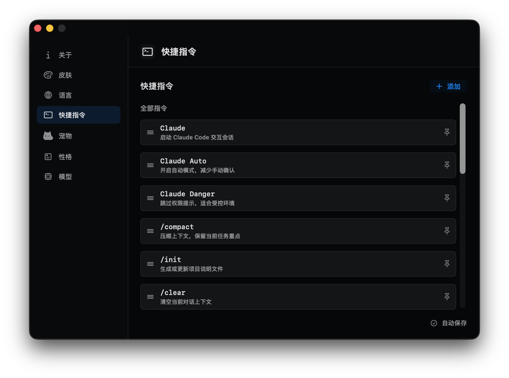
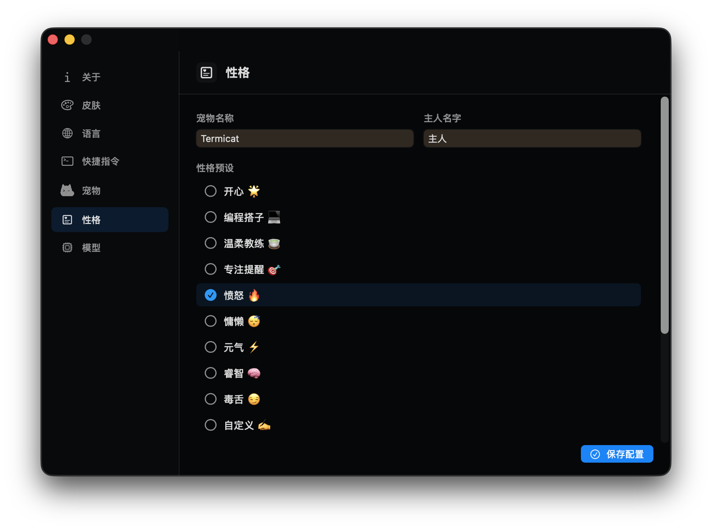
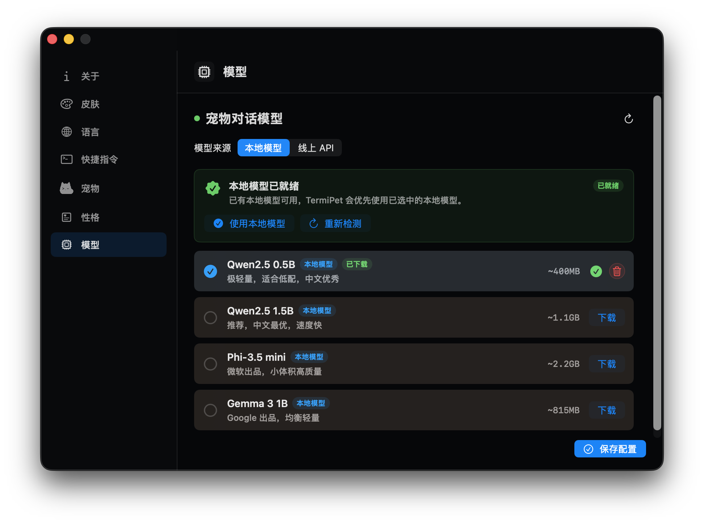
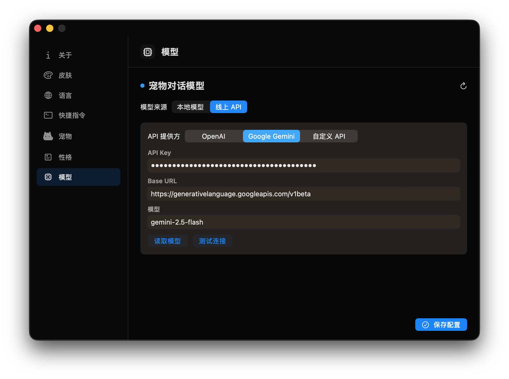

# TermiPet

<p align="center">
  
</p>
<p align="center">
  <b>一个面向 macOS 终端和 Claude Code 的桌面宠物助手</b>
</p>

<p align="center">
  <a href="README.md">简体中文</a>
  ·
  <a href="README.zh-TW.md">繁體中文</a>
  ·
  <a href="README.en.md">English</a>
  ·
  <a href="README.ja.md">日本語</a>
  ·
  <a href="README.ko.md">한국어</a>
</p>

<p align="center">
  
  
  
</p>

<p align="center">
  <a href="#快速开始">快速开始</a>
  ·
  <a href="#主要功能">主要功能</a>
  ·
  <a href="#隐私与数据">隐私与数据</a>
  ·
  <a href="#使用方式">使用方式</a>
  ·
  <a href="#开发">开发</a>
  ·
  <a href="#license">License</a>
</p>
TermiPet 是一个悬浮在 macOS 桌面上的宠物助手。它面向终端用户和 AI 编程工具用户，帮你**查看终端状态**、**发送常用命令**、**观察 Claude Code / Codex / GitHub Copilot 用量**，并支持用本地模型或线上 API 和宠物聊天。

<p align="center">
  
</p>

它不是单纯的桌面装饰，而是一个**轻量的工作流入口**：平时安静待在屏幕边缘，需要时展开工具栏、状态卡片、快捷命令、番茄钟和聊天窗口。

<p align="center">
  
</p>

## 主要功能

| 功能 | 说明 |
| --- | --- |
| 悬浮桌面宠物 | 以菜单栏应用运行，不占 Dock，可悬浮在屏幕边缘或终端旁。 |
| 终端识别 | 支持 Terminal、iTerm2、Ghostty、Warp、WezTerm、Alacritty、Kitty 等终端。 |
| 终端预览 | 聚焦终端时显示窗口标题、输出摘要、当前状态和提醒信息。 |
| 快捷指令面板 | 内置 Claude Code 常用命令，也支持添加、置顶、排序自定义命令。 |
| 文件夹快捷入口 | 选择项目文件夹后，自动向目标终端输入对应的 `cd` 命令。 |
| Claude Code Hook | 同步 Claude Code 的思考、工具调用、等待授权、压缩上下文、完成等状态。 |
| 宠物聊天 | 支持本地 Ollama、OpenAI、Google Gemini 和 OpenAI-compatible 自定义 API。 |
| 性格配置 | 支持宠物名、主人名、性格预设、自定义 Prompt 和额外约束。 |
| 番茄钟 | 支持 25 分钟专注和 5 分钟休息，完成时触发宠物庆祝动作。 |
| AI 用量卡片 | 尝试读取 Claude Code、Codex、GitHub Copilot 的轻量用量信息。 |
| 内置和自定义宠物 | 内置多款宠物，Terminal Cat 是 TermiPet 的吉祥物；也可导入自定义宠物资源包。 |
| 多语言和皮肤 | 支持简体中文、繁体中文、英文、日文、韩文，以及玻璃、暗色、像素等皮肤。 |

## 界面预览

### 状态卡片和授权提示

TermiPet 会把 Claude Code 等 AI 编程工具的状态整理成悬浮卡片，显示当前项目、执行动作、工作目录和 Hook 来源。遇到需要授权的 Bash 或工具调用时，也可以在卡片里直接看到 Allow / Deny 操作，减少在终端窗口之间来回找提示的成本。

<p align="center">
  
</p>

### 快捷指令面板

快捷指令面板把常用 Claude Code 命令放在手边，适合频繁使用 `/compact`、`/review`、`/status`、`/diff` 等命令的工作流。你可以用它一键把命令输入到当前终端，也可以在设置里添加自己的命令、调整顺序和置顶常用项。

<p align="center">
  
</p>

### 可切换宠物

TermiPet 内置多款宠物，默认主角是 `Terminal Cat`。宠物页可以切换内置角色，也可以导入自己的宠物资源包；不同宠物会跟随待机、思考、提醒、错误、庆祝等状态播放对应动作。

<p align="center">
  
</p>

### 宠物对话

点击悬浮工具栏里的聊天按钮，就可以和当前宠物直接对话。对话窗口会跟随桌面宠物一起出现，适合在写代码时快速问一句、让宠物解释当前状态，或用不同性格预设获得更有陪伴感的回应。聊天模型可以选择本地 Ollama，也可以配置 OpenAI、Google Gemini 或兼容 OpenAI API 的自定义服务。

<p align="center">
  
</p>

### 悬浮工具栏和用量卡片

鼠标移到宠物附近时，悬浮工具栏会展开，提供快捷指令、项目文件夹、聊天、皮肤和番茄钟入口。AI 用量卡片会读取 Claude Code、Codex、GitHub Copilot 的轻量套餐状态，帮助你在写代码时顺手看一眼剩余额度和重置时间。

<p align="center">
  
</p>

## 隐私与数据

TermiPet 是本地运行的 macOS 应用，**没有自建的云端中转服务器**。它尽量把配置、密钥和状态读取都留在你的 Mac 上，只在你主动配置并使用外部模型或官方服务接口时，才会向对应的服务地址发起请求。

| 数据类型 | 存放或使用方式 |
| --- | --- |
| 线上模型 API Key | **保存在 macOS 钥匙串中**，不写入普通配置文件，也不会上传到任何 TermiPet 自建服务器。 |
| 模型 Base URL 和模型名 | 保存在本地 Application Support 目录，用于决定请求哪个 API 地址。 |
| 本地 Ollama 聊天 | 请求发送到本机 Ollama 服务，不经过外部模型 API。 |
| OpenAI / Gemini / 自定义 API 聊天 | 只会在你选择线上模型时，请求你配置的模型服务地址。TermiPet 不提供中转服务器。 |
| Claude Code / Codex 套餐读取 | 读取本机已有登录凭据或本地配置，并从本机直接请求对应官方接口；**密钥不会上传到任何 TermiPet 自建服务器**。 |
| Claude Code Hook 状态 | Hook 只把事件发送给本机 `127.0.0.1` 上的 TermiPet 本地服务，用于更新宠物状态。 |
| 终端预览和快捷输入 | 依赖 macOS 辅助功能权限，在本机识别窗口标题、部分文本和输入命令。 |

换句话说：TermiPet 本身更像一个**本地插件和桌面助手**。聊天 API 会走你配置的请求地址；套餐读取会用本地已有凭据请求对应服务；终端状态、宠物配置、快捷指令和 API Key 都保存在本地。

## 系统要求

| 项目 | 要求 |
| --- | --- |
| 操作系统 | macOS 14.0 或更高版本 |
| 构建工具 | Swift 6 工具链 |
| 本地聊天 | 可选，需要安装并启动 [Ollama](https://ollama.com) |
| 线上模型 | 可选，需要 OpenAI、Google Gemini 或兼容服务的 API Key |
| 系统权限 | 终端预览和自动输入需要 macOS 辅助功能权限 |

## 下载与安装

### 直接下载 App

普通用户不需要自己编译，可以直接从 GitHub Releases 下载已经打包好的 macOS App：

1. 打开 [TermiPet Releases](https://github.com/bleeeet/TermiPet/releases)。
2. 下载最新版本里的 `TermiPet-v0.1-macOS.zip`。
3. 解压后得到 `TermiPet.app`。
4. 将 `TermiPet.app` 拖到「应用程序」文件夹，或直接双击运行。
5. 首次打开时，如果 macOS 提示来自未验证开发者，可以在「系统设置 -> 隐私与安全性」里允许打开。

启动后，TermiPet 会出现在 macOS 菜单栏中。它默认不会显示在 Dock 里。

终端预览、快捷命令输入、文件夹 `cd` 输入等能力需要 macOS 辅助功能权限。可以通过菜单栏里的「请求辅助功能授权」和「打开辅助功能设置」完成授权。

### 从源码构建

进入项目根目录后运行：

```zsh
zsh Scripts/build-plugin.sh
```

脚本会自动完成以下步骤：

1. 运行全部测试。
2. 编译 Swift Package。
3. 生成并刷新 `App/TermiPet.app`。
4. 复制二进制、资源和默认宠物包。
5. 清理扩展属性。
6. 使用本地自签证书签名；如果证书不可用，会回退到 ad-hoc 签名。
7. 关闭旧版本 TermiPet 进程并启动新版本应用。

更详细的普通用户操作说明见 [USAGE.md](USAGE.md)。

## 快速开始

### 1. 显示宠物

点击菜单栏里的 TermiPet 图标，选择「显示宠物」。

### 2. 授予辅助功能权限

如果你想使用终端预览、快捷命令输入、文件夹 `cd` 输入等能力，需要授予 macOS 辅助功能权限。

操作步骤：

1. 点击菜单栏 TermiPet 图标。
2. 选择「请求辅助功能授权」或「打开辅助功能设置」。
3. 在系统设置的辅助功能页面里找到 TermiPet。
4. 打开 TermiPet 的权限。
5. 如果没有立即生效，重启 TermiPet。

没有辅助功能权限时，宠物仍然可以显示和聊天，但终端读取、自动输入和部分状态识别会受限。

### 3. 使用悬浮工具栏

把鼠标移动到宠物上方，会出现一排工具按钮：

| 按钮 | 用途 |
| --- | --- |
| 终端 | 打开或收起快捷指令面板 |
| 文件夹 | 选择文件夹并向终端输入 `cd` |
| 聊天 | 打开宠物聊天窗口 |
| 调色板 | 在皮肤之间循环切换 |
| 计时器 | 开始、暂停或继续 25 分钟番茄钟 |
| 停止 | 番茄钟运行时停止计时 |
| 杯子 | 开始 5 分钟休息 |

宠物下方还有动作按钮，可手动触发待机、运行、移动、开心、提醒、错误、睡觉、思考、庆祝等动画。

## 使用方式

### 快速发送 Claude Code 命令

1. 打开并聚焦一个终端窗口。
2. 鼠标移到宠物上。
3. 点击终端按钮。
4. 从快捷指令面板选择命令。

内置命令包括：

```text
claude
claude --enable-auto-mode
claude --dangerously-skip-permissions
/compact
/init
/clear
/memory
/model
/help
/review
/status
/diff
/cost
/login
/config
/mcp
/doctor
/terminal-setup
```

你也可以在「设置 -> 快捷指令」里添加自己的命令，并调整置顶和排序。

<p align="center">
  
</p>

### 快速切换项目目录

点击文件夹按钮，选择一个项目文件夹。TermiPet 会把对应的 `cd` 命令输入到最近使用的目标终端中。

### 查看 Claude Code 状态

TermiPet 可以通过 Claude Code Hook 接收开发 Agent 状态。安装后，宠物卡片可以显示 Claude Code 是否正在思考、调用工具、等待授权、压缩上下文或已经完成。

菜单栏提供：

- 安装 Claude Code Hook
- 卸载 Claude Code Hook

安装动作会修改：

```text
~/.claude/settings.json
~/.claude/hooks/
```

第一次安装时会备份原始设置到：

```text
~/.claude/settings.json.floating-pet.bak
```

安装后需要重启正在运行的 `claude` 进程才能生效。Hook 会把本机 Claude Code 事件发送给 TermiPet 启动在 `127.0.0.1` 的本地服务，用于更新宠物状态，不需要外部服务器参与。

### 和宠物聊天

点击聊天按钮即可打开聊天窗口。聊天模型有两种来源：

| 模型来源 | 说明 |
| --- | --- |
| 本地 Ollama | 适合希望本地运行、减少外部 API 依赖的用户。 |
| 线上 API | 支持 OpenAI、Google Gemini 和兼容 OpenAI Chat Completions 的自定义服务。 |

API Key 会保存在 macOS 钥匙串中，普通配置会保存在 Application Support 目录。

## 设置

从菜单栏点击「设置...」，或右键宠物选择「设置...」，可以进入设置窗口。

| 页面 | 用途 |
| --- | --- |
| 关于 | 查看版本、开发者和项目信息。 |
| 皮肤 | 切换玻璃、暗色、像素等外观。 |
| 语言 | 切换简体中文、繁体中文、英文、日文、韩文，重启后完整生效。 |
| 快捷指令 | 管理内置命令和自定义命令，支持添加、删除、置顶和拖拽排序。 |
| 宠物 | 导入并选择宠物资源包。 |
| 性格 | 配置宠物名称、主人名称、性格预设、自定义 Prompt 和额外约束。 |
| 模型 | 配置本地 Ollama 或线上 API 聊天模型。 |

<p align="center">
  
</p>

## 宠物聊天模型

### 本地模型

设置路径：`设置 -> 模型 -> 本地模型`。

TermiPet 会检测 Ollama 是否运行。内置模型目录包括：

<p align="center">
  
</p>

| 模型 | 说明 | 大小 |
| --- | --- | --- |
| Qwen2.5 0.5B | 极轻量，适合低配，中文优秀 | ~400MB |
| Qwen2.5 1.5B | 推荐，中文较好，速度快 | ~1.1GB |
| Phi-3.5 mini | 小体积高质量 | ~2.2GB |
| Gemma 3 1B | 均衡轻量 | ~815MB |

未下载的模型不能直接选择。可以在设置页启动 Ollama、打开安装页、下载推荐模型或手动刷新检测结果。

### 线上 API

设置路径：`设置 -> 模型 -> 线上 API`。

支持：

<p align="center">
  
</p>

- OpenAI，默认 Base URL 为 `https://api.openai.com/v1`。
- Google Gemini，默认 Base URL 为 `https://generativelanguage.googleapis.com/v1beta`。
- 自定义 API，适用于兼容 OpenAI Chat Completions 格式的服务。

API Key 会保存在 macOS 钥匙串中；Base URL、模型名等非敏感配置会保存在 Application Support 目录。填写后建议先点击「读取模型」和「测试连接」。

## 自定义宠物

TermiPet 内置多款宠物。默认主角是 `Terminal Cat`，它是一只陪在终端旁边的小猫，也是这个软件的吉祥物。内置宠物里还包括偏像素风的猫、巫师克劳德、Mochi 等角色；你也可以导入自己的宠物资源包，与 Codex 宠物文件兼容。

宠物资源包是一个文件夹，至少需要包含：

```text
pet.json
spritesheet.webp
```

`pet.json` 示例：

```json
{
  "id": "example-pet",
  "displayName": "Example Pet",
  "description": "A custom pixel pet.",
  "spritesheetPath": "spritesheet.webp"
}
```

spritesheet 默认按 9 行动作解析：

| 索引 | 动作 |
| --- | --- |
| 0 | 待机 |
| 1 | 运行 |
| 2 | 移动 |
| 3 | 开心 |
| 4 | 提醒 |
| 5 | 错误 |
| 6 | 睡觉 |
| 7 | 思考 |
| 8 | 庆祝 |

导入后的宠物会复制到：

```text
~/Library/Application Support/TermiPet/ImportedPets/
```

当前选择记录保存在：

```text
~/Library/Application Support/TermiPet/selected-pet.json
```

## 设计思路

TermiPet 的设计分成三层：

### 悬浮陪伴层

宠物是用户看得见的入口。它默认保持轻量，不强行占用注意力；当鼠标悬停时，再展开工具栏、状态卡片、用量卡片和聊天窗口。

### 工作流辅助层

TermiPet 会识别当前终端、编辑器和 AI 对话应用，并把这些上下文转成更容易看的状态提示。

它重点服务三个动作：

- 看：查看终端、编辑器、Agent 和 AI 用量状态。
- 点：点击发送常用命令、切换目录、启动计时。
- 聊：通过本地或线上模型和宠物对话。

### 配置扩展层

命令、宠物、皮肤、语言、聊天模型、性格 Prompt 都做成可配置内容。后续可以继续扩展宠物资源包、命令模板、模型服务和更多开发工作流。

## 项目结构

```text
.
├── README.md
├── USAGE.md
├── LICENSE
├── Scripts/
│   ├── build-plugin.sh          # 测试、构建、签名并启动 App
│   └── open-plugin.sh           # 打开已有 App
├── Source/
│   ├── Package.swift            # Swift Package 配置
│   ├── AppBundle/               # Info.plist 与 App 图标
│   ├── Sources/
│   │   ├── TermiPet/            # macOS App、SwiftUI 界面和系统集成
│   │   └── TermiPetCore/        # 核心模型、配置、策略和纯逻辑
│   └── Tests/TermiPetTests/     # 单元测试
├── Pets/                        # 默认宠物资源包
├── icon/                        # 原始图标和社交图标素材
└── App/TermiPet.app             # 构建产物，由脚本生成
```

## 开发

完整构建、测试、签名并启动：

```zsh
zsh Scripts/build-plugin.sh
```

仅运行测试：

```zsh
cd Source
swift test
```

仅编译调试版本：

```zsh
cd Source
swift build -c debug
```

源码构建会在本机生成 `App/TermiPet.app`，适合开发者自己调试或打包。

## 配置文件

TermiPet 的用户配置主要保存在：

```text
~/Library/Application Support/TermiPet/
```

常见文件：

| 文件 | 说明 |
| --- | --- |
| `config.json` | 快捷指令配置 |
| `personality.json` | 宠物性格配置 |
| `ollama-config.json` | 模型来源、Base URL 和模型名 |
| `selected-pet.json` | 当前选择的宠物文件夹路径 |
| `ImportedPets/` | 导入后的宠物资源包 |

线上模型 API Key 保存在 macOS 钥匙串中，不写入普通 JSON 配置文件。

## 权限和隐私

TermiPet 可能需要辅助功能权限，用于：

- 识别当前前台终端、编辑器或 AI 应用。
- 读取终端窗口标题和部分文本，生成终端预览。
- 将快捷指令或 `cd` 命令输入到终端。

如果不授权，应用仍可运行，但终端预览和自动输入能力会受限。可以通过菜单栏「打开辅助功能设置」前往系统设置授权。更完整的数据说明见上方「隐私与数据」。

## Roadmap

- 提供更稳定的安装包发布流程。
- 增加更多默认宠物资源。
- 增强更多 AI 编程工具的状态识别。
- 优化新手引导和首次授权体验。

## 贡献建议

- 行为改动请补充或更新测试。
- 修改代码或资源后请运行 `zsh Scripts/build-plugin.sh` 并验证 App。

## 致谢

TermiPet 的使用场景离不开这些 AI 编程和模型生态的启发与兼容支持：**Claude Code**、**Codex**、**Google Gemini**、**GitHub Copilot** 和 **Ollama**。它们不是 TermiPet 的官方贡献者或背书方，但 TermiPet 围绕这些工具的本地工作流、状态显示、用量读取和宠物对话体验做了适配。

## License

本项目使用 Apache License 2.0。详见 [LICENSE](LICENSE)。
